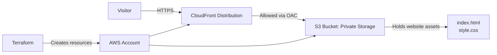

# Terraform Static Website on AWS

A simple Terraform project that provisions a secure static website on AWS using Amazon S3 and CloudFront.

This demo hosts a portfolio-style website from a private S3 bucket while exposing it publicly through CloudFront over HTTPS. The bucket is configured to block public access and only allows the CloudFront distribution to read its objects via Origin Access Control (OAC).

## Overview

This project demonstrates:

- Infrastructure as Code with Terraform
- Secure static web hosting on AWS
- Private S3 storage with public access blocked
- CloudFront content delivery and HTTPS support
- Declarative provisioning for repeatable deployments

## What Terraform provisions

The configuration creates and manages these AWS resources:

- An S3 bucket for static website files
- Bucket public access block settings to keep the bucket private
- `index.html` and `style.css` uploaded into the bucket
- A CloudFront Origin Access Control (OAC)
- A CloudFront distribution for HTTPS delivery
- A bucket policy that permits only CloudFront to fetch objects
- A Terraform output showing the live website URL

## Architecture diagram



## Project structure

```text
.
├── main.tf
├── README.md
├── website/
│   ├── index.html
│   └── style.css
├── .terraform/
├── .terraform.lock.hcl
├── terraform.tfstate
├── terraform.tfstate.backup
```

## Why this setup is secure

The S3 bucket is intentionally not public. To keep the site accessible while protecting the origin:

- public access is blocked with `aws_s3_bucket_public_access_block`
- CloudFront is configured as the only allowed reader via Origin Access Control
- a bucket policy grants `s3:GetObject` only for the CloudFront distribution ARN
- users connect through the CloudFront domain instead of directly to S3

This creates a clean pattern for static hosting without exposing the underlying storage bucket to the internet.

## Prerequisites

Before running this project, make sure you have:

- Terraform installed
- AWS CLI configured or valid AWS credentials available
- Permission to create S3 and CloudFront resources in your AWS account

## Important configuration note

The bucket name in `main.tf` must be globally unique across all AWS accounts:

```hcl
bucket = "nextwork-unique-bucket-htetmyark-001"
```

If that name is already taken, change it to a new unique value before running `terraform apply`.

## Deployment steps

Initialize Terraform:

```bash
terraform init
```

Review the deployment plan:

```bash
terraform plan
```

Apply the infrastructure:

```bash
terraform apply
```

Print the deployed website URL:

```bash
terraform output website_url
```

## How the site is served

1. A user requests the website through the CloudFront URL.
2. CloudFront checks the request and forwards it to the S3 origin.
3. The S3 bucket is private, so CloudFront accesses it using OAC and the bucket policy.
4. The site files are returned over HTTPS.
5. The website loads without exposing the raw S3 bucket to the public internet.

## Benefits

- Low-cost static hosting
- Secure by default
- Easy to manage with Terraform
- Fast global delivery through CloudFront
- Suitable for personal sites, portfolios, and demo apps

## Cleanup

Remove all created AWS resources:

```bash
terraform destroy
```

## Summary

This project is a practical example of hosting a static website on AWS in a secure and scalable way. It highlights a common production pattern: keeping storage private while using CloudFront to deliver content quickly and safely.

This is a great starting point for learning Terraform, S3, and CloudFront together.
